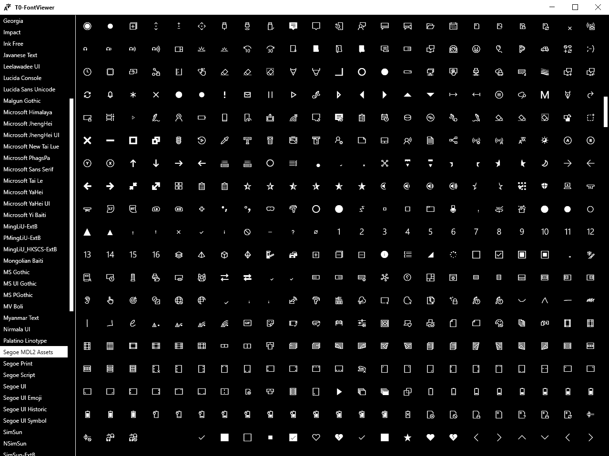

# T0-FontViewer

T0-FontViewer is an open source WPF based FontViewer/GlyphPicker. It can display all installed fonts on the system and you can click the glyph to copy its unicode to the clipboard. The application was created with the intention to make it easy to pick unicodes for icons from custom iconfonts. 

You can create requests to control the development direction e.g. more focus on normal fonts than on icons etc.

## Known Issues

- Selecting a large font, will take very long to load, speaking of multiple seconds
